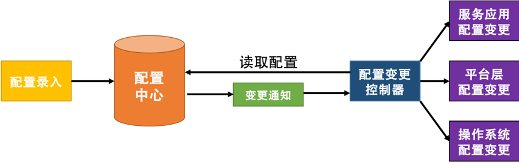

# 管理设计

## 分布式锁 Distributed Lock

### 特点

- 排他性：任意时刻，只有一个客户端可以获得锁
- 避免死锁：客户端最终一定可以获得锁，即使锁住某个资源的客户端在释放锁之前崩溃或网络不可达
- 容错性：只要锁服务集群中的大部分节点存活，客户端就可以进行加锁解锁操作

### Redis／ZK分布式锁
### 乐观锁
### CAS原子操作

### 分布式锁的设计重点

- 获得锁的进程挂了怎么办？过期自动解除
- 锁自动解除了，新的进程拿到了锁，原来的进程以为自己还有锁怎么办？使用Redis的话可以使用Check and Set重新判断数据库的值是否是之前读到的值；使用CAS的话就不需要分布式锁了
- 分布式锁应该是高可用而且需要持久化，例：[Redis Lock](https://redis.io/topics/distlock)
- 要提供非阻塞方式的锁服务
- 考虑锁的重入性

## 配置中心 Configuration Management

### 配置中心的设计

#### 区分软件的配置

##### 静态配置

- 软件／环境初始化时用到的环境，运行时基本不变
- 例如：网络配置、Docker进程配置

##### 动态配置

- 按运行环境分：开发环境、测试环境、生产环境
- 按依赖分：一种是依赖配置，一种是不依赖的内部配置；依赖配置如Redis／Mysql链接配置；
- 按层次分：laaS、PaaS、SaaS；基础层的配置是操作系统的配置；中间层的配置是中间件的配置；上层软件的配置是服务自己的配置

#### 配置中心的模型

- Key-Value
- 按照层次分，操作系统及中间层的配置需要有相关模版及检查，或者不提供自定义填写，只能选择提供项；应用层配置需要明确配置规范
- 外部依赖的配置建议不放到配置中心，而是放到服务发现系统中，

#### 配置中心的架构

- 

## 边车模式 Sidecar

## 服务网格 Service Mesh

## 网关模式 Gateway
