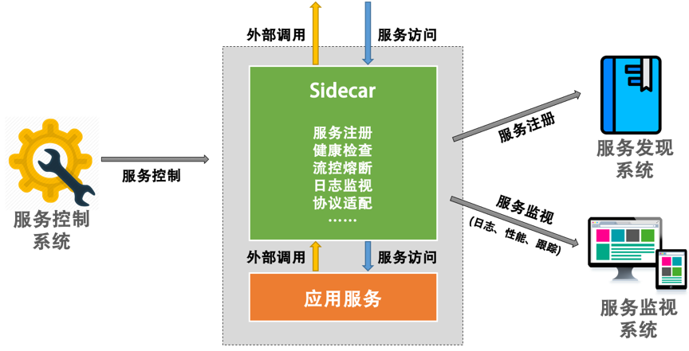

# 管理设计

## 分布式锁 Distributed Lock

### 特点

- 排他性：任意时刻，只有一个客户端可以获得锁
- 避免死锁：客户端最终一定可以获得锁，即使锁住某个资源的客户端在释放锁之前崩溃或网络不可达
- 容错性：只要锁服务集群中的大部分节点存活，客户端就可以进行加锁解锁操作

### Redis／ZK分布式锁
### 乐观锁
### CAS原子操作

### 分布式锁的设计重点

- 获得锁的进程挂了怎么办？过期自动解除
- 锁自动解除了，新的进程拿到了锁，原来的进程以为自己还有锁怎么办？使用Redis的话可以使用Check and Set重新判断数据库的值是否是之前读到的值；使用CAS的话就不需要分布式锁了
- 分布式锁应该是高可用而且需要持久化，例：[Redis Lock](https://redis.io/topics/distlock)
- 要提供非阻塞方式的锁服务
- 考虑锁的重入性

## 配置中心 Configuration Management

### 配置中心的设计

#### 区分软件的配置

##### 静态配置

- 软件／环境初始化时用到的环境，运行时基本不变
- 例如：网络配置、Docker进程配置

##### 动态配置

- 按运行环境分：开发环境、测试环境、生产环境
- 按依赖分：一种是依赖配置，一种是不依赖的内部配置；依赖配置如Redis／Mysql链接配置；
- 按层次分：laaS、PaaS、SaaS；基础层的配置是操作系统的配置；中间层的配置是中间件的配置；上层软件的配置是服务自己的配置

#### 配置中心的模型

- Key-Value
- 按照层次分，操作系统及中间层的配置需要有相关模版及检查，或者不提供自定义填写，只能选择提供项；应用层配置需要明确配置规范
- 外部依赖的配置建议不放到配置中心，而是放到服务发现系统中，

#### 配置中心的架构

- 

## 边车模式 Sidecar

- 

### 设计重点

- 控制和逻辑的分离
- 服务调用中上下文的问题，如重试与重试次数这样的数据
- 进程间通讯，推荐使用网络调用，因为在127.0.0.1，所以开销不明显
- 协议推荐统一，有两层协议，一层是sidercar到server的内部协议，一层是sidercar到远程sidercar的外部协议
- 需要配合DevOps
- Sidercar中所实现的功能应该是控制面上的东西，不要把业务逻辑设计到其中
- 小心在sidecar中的通用功能带来的影响，如重试，可能不是所有业务都有做幂等

### 适用场景

- 老应用系统的改造和扩展
- 多语言的混合分布式系统的管理和扩展
- 应用服务由不同的供应商提供
- 把控制和逻辑分离

### 不适用场景

- 架构并不复杂的时候
- 服务间的协议不标准且无法转换
- 不需要分布式

## 服务网格 Service Mesh

### Service Mesh 的演化路径

- 主机间的进程通讯
- 分离出网络层，服务间的网络通讯，交给底层的网络模型处理
- 由于服务的接受速度不一致，需要应用层实现流控
- 流控也可以交给网络层实现，-> TCP／IP
- [分布式的八个谬论](https://en.wikipedia.org/wiki/Fallacies_of_distributed_computing), 意识到分布式系统需要由弹力设计
- 弹力设计是可以标准化的，将这些模式写成SDK／Lib／Framework，集成到应用服务中
- SDK／Lib／Framework是不能跨语言的，有改动的话需要重新编译重新发布，应该有一个专门的层来做这件事，Sidecar诞生了。
- 

## 网关模式 Gateway
