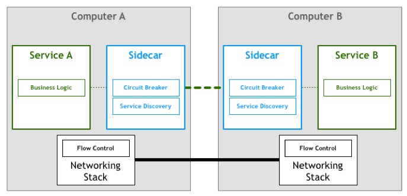
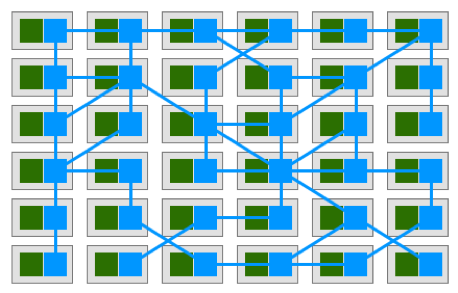
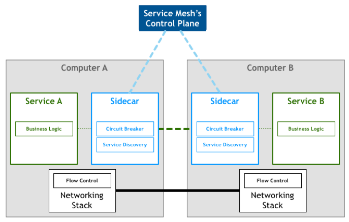
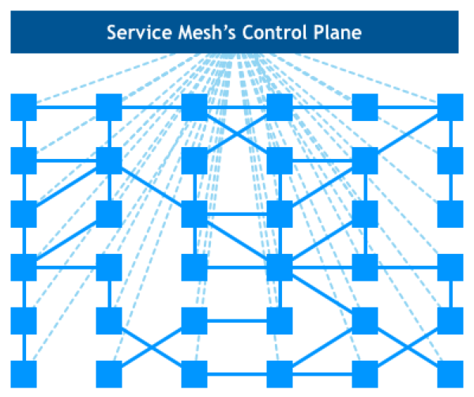
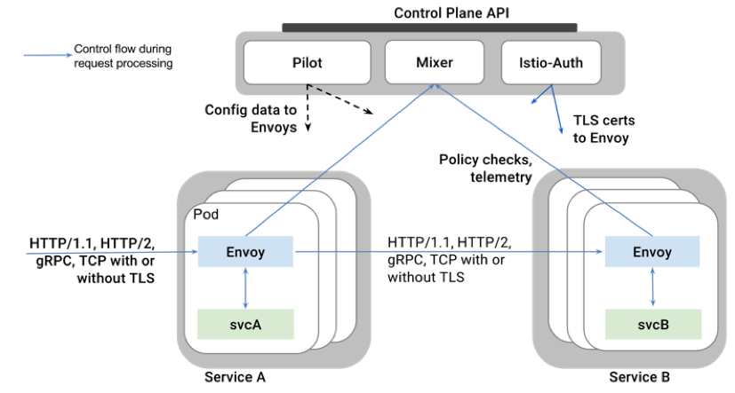
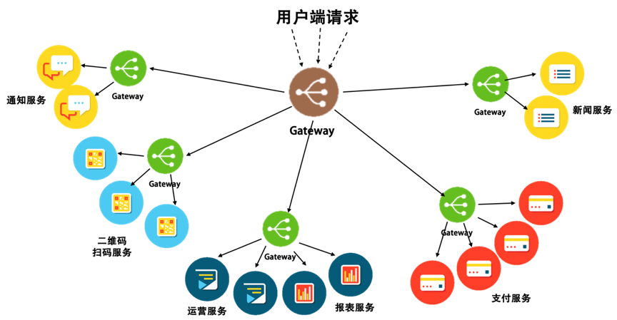
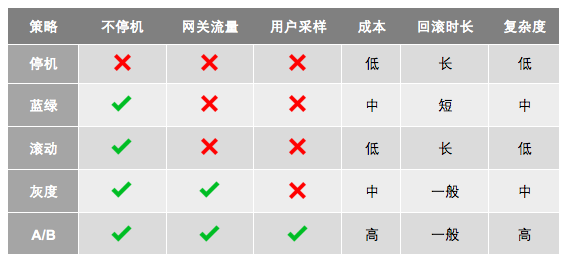

# 管理设计

## 分布式锁 Distributed Lock

### 特点

- 排他性：任意时刻，只有一个客户端可以获得锁
- 避免死锁：客户端最终一定可以获得锁，即使锁住某个资源的客户端在释放锁之前崩溃或网络不可达
- 容错性：只要锁服务集群中的大部分节点存活，客户端就可以进行加锁解锁操作

### Redis／ZK分布式锁
### 乐观锁
### CAS原子操作

### 分布式锁的设计重点

- 获得锁的进程挂了怎么办？过期自动解除
- 锁自动解除了，新的进程拿到了锁，原来的进程以为自己还有锁怎么办？使用Redis的话可以使用Check and Set重新判断数据库的值是否是之前读到的值；使用CAS的话就不需要分布式锁了
- 分布式锁应该是高可用而且需要持久化，例：[Redis Lock](https://redis.io/topics/distlock)
- 要提供非阻塞方式的锁服务
- 考虑锁的重入性

## 配置中心 Configuration Management

### 配置中心的设计

#### 区分软件的配置

##### 静态配置

- 软件／环境初始化时用到的环境，运行时基本不变
- 例如：网络配置、Docker进程配置

##### 动态配置

- 按运行环境分：开发环境、测试环境、生产环境
- 按依赖分：一种是依赖配置，一种是不依赖的内部配置；依赖配置如Redis／Mysql链接配置；
- 按层次分：laaS、PaaS、SaaS；基础层的配置是操作系统的配置；中间层的配置是中间件的配置；上层软件的配置是服务自己的配置

#### 配置中心的模型

- Key-Value
- 按照层次分，操作系统及中间层的配置需要有相关模版及检查，或者不提供自定义填写，只能选择提供项；应用层配置需要明确配置规范
- 外部依赖的配置建议不放到配置中心，而是放到服务发现系统中，

#### 配置中心的架构

- 

## 边车模式 Sidecar

- 

### 设计重点

- 控制和逻辑的分离
- 服务调用中上下文的问题，如重试与重试次数这样的数据
- 进程间通讯，推荐使用网络调用，因为在127.0.0.1，所以开销不明显
- 协议推荐统一，有两层协议，一层是sidecar到server的内部协议，一层是sidecar到远程sidecar的外部协议
- 需要配合DevOps
- Sidecar中所实现的功能应该是控制面上的东西，不要把业务逻辑设计到其中
- 小心在sidecar中的通用功能带来的影响，如重试，可能不是所有业务都有做幂等

### 适用场景

- 老应用系统的改造和扩展
- 多语言的混合分布式系统的管理和扩展
- 应用服务由不同的供应商提供
- 把控制和逻辑分离

### 不适用场景

- 架构并不复杂的时候
- 服务间的协议不标准且无法转换
- 不需要分布式

## 服务网格 Service Mesh

### Service Mesh 的演化路径

- 主机间的进程通讯
- 分离出网络层，服务间的网络通讯，交给底层的网络模型处理
- 由于服务的接受速度不一致，需要应用层实现流控
- 流控也可以交给网络层实现，-> TCP／IP
- [分布式的八个谬论](https://en.wikipedia.org/wiki/Fallacies_of_distributed_computing), 意识到分布式系统需要由弹力设计
- 弹力设计是可以标准化的，将这些模式写成SDK／Lib／Framework，集成到应用服务中
- SDK／Lib／Framework是不能跨语言的，有改动的话需要重新编译重新发布，应该有一个专门的层来做这件事，Sidecar诞生了。
- Sidecar集群组成Service Mesh , 绿色代表应用服务，蓝色是sidecar，
- Sidecar组成一个平台，一个Cloud Native的服务流量调度的平台，加上整个集群饿管理控制面板，就成了整了Service Mesh的架构
- , 

### 相关开源软件

- lstio 
- Conduit
- Linkerd

## 网关模式 Gateway

- Sidecar的运维成本大，因为每个服务都需要一个Sidecar
- 
- 上图展示的是一个多层Gateway架构，其中有一个总Gateway接入所有的流量，并分发给不同的子系统，还有第二级的Gateway用于做各个子系统的接入Gateway

### 网管模式设计

#### 基础功能

- 请求路由：调用端不需要知道服务地址，全部交给Gateway
- 服务注册：服务实例将其提供的服务的地址注册、取消注册到网关
- 负载均衡：对各服务实例做负载均衡策略
- 弹力设计：异步、重试、幂等、流控、熔断、监视等
- 安全方面：SSL 加密及证书管理、Session 验证、授权、数据校验，以及对请求源进行恶意攻击的防范。

#### 其他功能

- 灰度发布：对相同服务的不同版本进行导流
- API聚合：将客户端请求分到多个后端服务，在对结果做组合拼装
- API编排：串联一些列的API接口完成业务流程

### 网关设计重点

#### 高性能

- C/C++ Linux下的epoll， windows下的I/O Completion Port
- Java的Netty、Vert.x、Spring Reactor 的 NIO 框架
- GO的goroutine、channel

#### 高可用

- 集群化：网关需要组成集群，并且自己同步集群数据
- 服务化：要做到在不间断的情况下修改配置，一种是像Nginx Reload配置那样，可以做到不停服务，另一种是最好做到服务化，得有自己的Admin API来在运行时修改自己的配置
- 持续化：例如重启，做到像Nginx那样优雅的重启

#### 高扩展

- 一个好的Gateway需要时可以扩展的，并能进行二次开发的。如AWS Lambda

#### 运维

- 业务松耦合，协议紧耦合
- 应用监视，提供分析数据
- 用弹力设计保护后端
- DevOps

#### 架构方面的注意事项

- 不要再网关的代码中内聚后端服务的功能，可以使用Plugin的方式或形成一个Serverless服务
- 网关应该靠近后端服务，并和后端使用同一个内网，保证调用的低延时；网关处理的静态内容应该靠近用户（应该放到CDN）
- 网关也需要做容量扩展，所以需要成为一个集群分担流量。这一点要么通过DNS轮训，要么通过CDN来做流量调度，或者通过更为底层的性能更高的负载均衡设备
- 对于服务发现，可以做一个时间不长的缓存，这样不用每次都去查询服务地址。如果系统不复杂，可以考虑把服务发现集成到网关中
- 为网关考虑bulkhead设计方式。用不同的网关服务不同的后端服务，或者用不同的网关服务不同的前端客户

#### 安全

- 加密数据：可以把SSL证书放到网关上，由网关统一做SSL传输管理
- 校验用户的请求：一些基本的用户校验可以放在网关上做，例如Token校验。但需要权衡一下，网关是否需要校验用户输入，以免影响网关性能
- 检测异常访问：QPS、4XX、5XX...

## 部署设计策略

- 

### 停机部署（Big Bang / Recreate）

- 现有版本服务停机，然后部署新版本
- 简单粗暴，影响太大

### 蓝绿部署（Blue/Green /Stage）

- 部署新版本，然后将老流量切换到新服务
- 浪费资源

### 滚动部署（Rolling Update / Ramped）

- 一点一点的升级现有的服务
- 生产环境同时运行两个版本的服务，用户请求会在新老版本服务来回切换，容易产生兼容问题

### 灰度部署（Canary）

- 先把一部分用户切到新版本，确认没有问题之后，继续扩大升级
- 多用于缺少足够测试或对稳定性缺乏信心的情况

### AB 测试（A/B Testing）

- 同时上线两个版本，然后做相关比较
- 通常用来测试应用功能的表现，如可用性、受欢迎程度...
