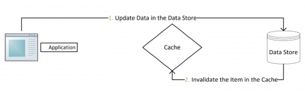
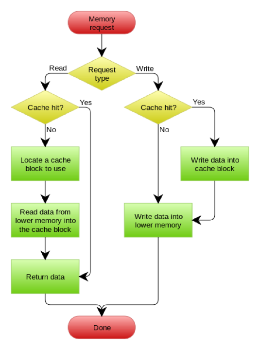
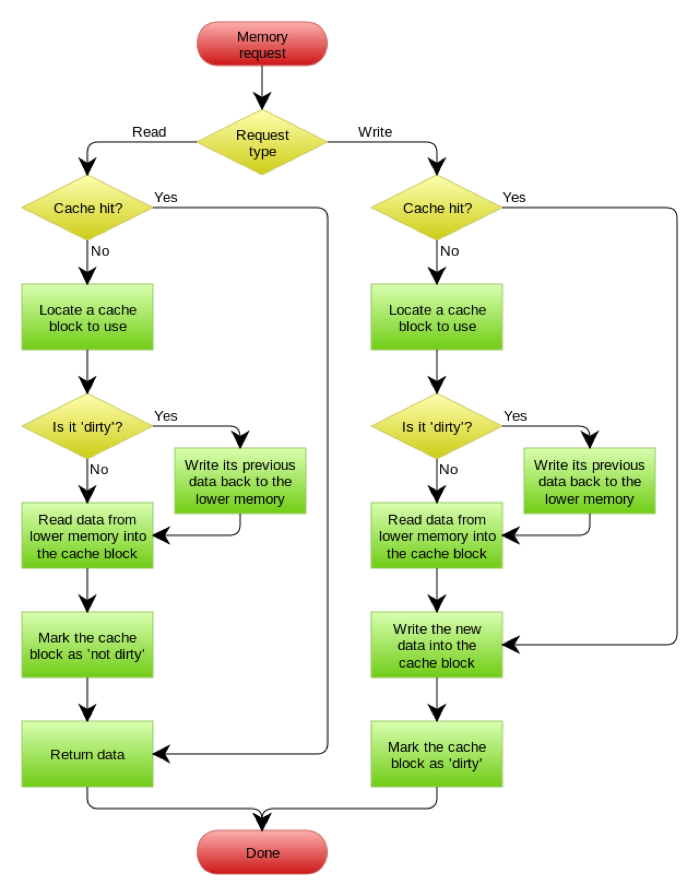
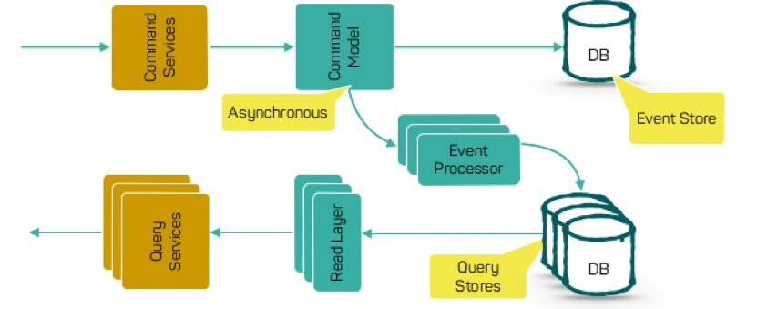
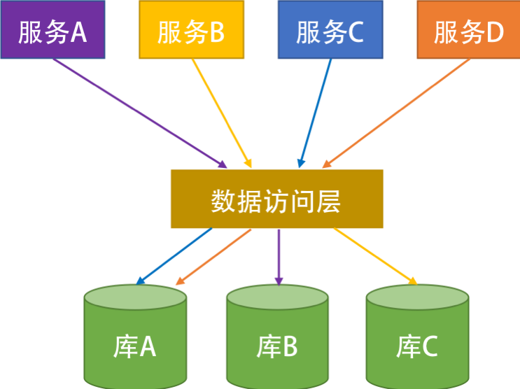

# 性能设计

## 缓存 Cache

### Cache Aside 更新模式

- 命中：从Cache中去数据，然后返回
- 实效：先从Cache中去数据，没有取到则到数据库中查询，并放入缓存
- 更新：先把数据写入数据库，然后使缓存实效
- 
- 

### Read/Write Through 更新模式

- Read Through中，当缓存失效时，在Cache Aside中由调用方负责将数据写入缓存，而在Read Through则用缓存服务自己来加载数据，对应用方透明
- Write Through中，当有数据更新时，如果没有命中缓存，则直接更新数据库，然后返回；否则，则更新缓存，然后由Cache更新数据库(同步操作)
- 

### Write Behind Caching

- 更新数据时，只更新缓存，不更新数据库；然后由缓存异步批量更新数据库
- 数据不是强一致的，可能会丢失
- 逻辑比较复杂，需要track那些数据是被更新了的，需要刷到持久层上，
- 

## 异步处理 Asynchronous

### 异步处理的设计

- 前台系统-记录请求，只做追加操作
- 任务处理系统
  - Push模型： 派发任务到worker；可以做调度但需要知道下游工作节点的情况
  - Pull模型： worker主动获取任务；缺少整体的任务调度
  - 异步消息与订阅
- 事件回溯（Event Sourceing + CQRS）
  - https://github.com/cer/event-sourcing-examples
- 异步处理的分布式事务
  - 凭证需要很好的保存，不然事务无法执行下去
  - 凭证需要处理幂等问题
  - 事务补偿

### 设计要点

- 事件驱动 + 事件溯源
- 任务处理完所要回传状态给发起方
- 发起方要设超时时间，方便重试（幂等）
- 补偿
- 不适合强一致性任务
- 监控任务积压状况

## 数据库扩展

### 读写分离：减少读操作压力

- 优点
  - 实现容易，master-slave
  - 业务隔离
  - 负载均衡
- 缺点
  - 写库单点故障
  - 数据库同步

### CQRS （Command and Query Responsibility Segregation）

- Command命令不会返回结果数据，但会返回执行状态，会改变数据
- Query返回结果数据，但不会该数据，对系统没有副作用
- 优点
  - 分工明确
  - 在系统演化中保持灵活，防止以防改动对另一方有影响
  - 逻辑清晰，可以看到哪些操作导致系统状态变化
  - 可以从数据驱动转到任务驱动或事件驱动
- 

### 垂直分片

- 把一张表里的字段分到不同的表中
- 把经常修改的数据和不经常修改的数据分隔开
- 修改数据时不会导致其他数据被锁住

### 分库分表 Sharding（水平分片）

- 
- 数据访问层：做数据路由
- 分片策略
  - 按照用户。如用户ID
  - 数据种类。如商品类目、地理位置
  - 范围。保证同一分片的数据是连续的
- 注意
  - 哈希（忌）。会带跨库查询、扩容Rehash的问题
  - 数据分片需要从业务角度考虑，而不是从技术角度入手
  - 随着数据变化，可能需要重新平衡分片，该操作非常昂贵；若想减少平衡分片的频率，需要确保每一个分片有足够的可用空间处理一段时间内的需求；还需要开发快速平衡分片的工具
  - 分片是静态的，而数据访问是不可预期的，可能需要经常的调整分片，这样的成本太高；最好使用一个索引表的方式分片，那数据的索引动态的记录在索引表中，当数据调度到另一个节点时，只需要更改索引表的信息
  - 如果程序必须读取不同分片的数据时，可以使用并行查询；但会增加数据访问的逻辑复杂度
  - 数据分片之后，很难在分片之间保持引用完整性和一致性，也就是跨分片的事务，因此需要减少会影响多个分片中的数据的操作；若必须跨分片修改数据，需要评估一致性及是否需要两阶段提交
  - 配置和管理分片；

### 数据库扩展的重点

- 数据库与服务一起拆分，一个服务一个数据库，服务之间通过接口通讯

## 秒杀 Flash Sales

- CDN
- 机率控制

## 边缘计算 Edge Computing

- [Netflix全球边缘架构](https://www.slideshare.net/MikeyCohen1/edge-architecture-ieee-international-conference-on-cloud-engineering-32240146)

### 边缘计算的关键计数

- Gateway （如AWS API Gateway）
- Serverless／Faas

### 开源项目

- [ServerLess Framework](https://github.com/serverless/serverless)
- [Fission](https://github.com/fission/fission)
- [open-lambda](https://github.com/open-lambda/open-lambda)
- [open-Fass](https://github.com/openfaas/faas)
- [iron-io](https://github.com/iron-io/functions)
